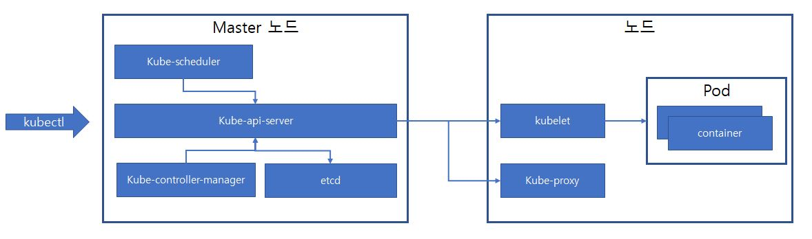

쿠버네티스를 설치 및 사용하기 앞서 쿠버네티스의 아키텍처와 구성요소들에 대해 살펴본다.

# 1. 쿠버네티스(k8s)란?
쿠버네티스는 컨테이너화 된 서비스를 관리하기 위한 이식성이 높고 확장 가능한 오픈소스 플랫폼이다. (컨테이너 오케스트레이터) 

실행중인 컨테이너에 장애가 발생했을 경우 빠르게 복구하여 장애를 방지 하고 여러 Node에 적절하게 자원을 분배 하는 특징을 가짐

## 쿠버네티스 아키텍쳐

- Master: 노드를 제어하고 쿠버네티스 클러스터 전체 관리
	- kube-api-server
	
	  : 쿠버네티스 API를 사용할 수 있도록 해주는 컴포넌트. 쿠버네티스의 모든 요청은 apiserver를 통해 이루어짐.
	
	- kube-scheduler
	
	  : 새로 생성된 Pod를 알맞은 노드에 할당하는 작업을 함. (H/W 요구사항, Affinitym Anti-affinity 등 다양한 요소 고려)
	
	- kube-controller-manager
	
	  : Master상에서 컨트롤러를 구동하는 컴포넌트
	
	  1. Replica Controller : 지정한 수의 Pod를 맞추고 관리
	  2. Service Controller: 클라우드에서 제공하는 로드밸런서 관리
	  3. Node Controller : 노드가 다운되면 통지와 대응
	
	  > 이 외에도 여러 종류가 있다. cloud-controller-manager와 구분 하는 경우가 있는데 공부 필요
	
	- etcd
	
	  : 클러스터의 데이터베이스 역할. 키-값 형태로 구성되며 클러스터의 상태와 설정을 저장
- Node: 컨테이너가 배포될 물리/가상 서버  (worker node)
	- Pod: 단일 노드에 배포된 하나 이상의 컨테이너 그룹
	
	- kubelet
	
	  : 모든 노드에서 실행되는 에이전트. 컨테이너가 Pod Spec에 맞게 동작하는 것을 확인
	
	- kube-proxy
	
	  : 노드에서 실행되는 가상 네트워크 관리

## 쿠버네티스 주요 오브젝트

### Node

물리 서버/가상 머신. 1개의 노드 = 1대의 머신

### Pod

하나 이상의 컨테이너로 구성 된 쿠버네티스의 가장 작은 배포 단위

생성 될 때 가상의 유동 IP를 부여 받고, 외부에서는 Pod로 직접 접근이 불가능 함.

Pod의 컨테이너간에 저장소와 네트워크를 공유한다(localhost) 

### Service

외부에서 Pod에 접근하기 위해 Service는 고정적인 가상 IP를 가지고 있음. Pod를 생성할 때 붙인 라벨을 Service를 생성할 때 Selector로 설정해주면 서비스는 해당 Pod들을 찾아서 연결 함.

- ClusterIP : 외부 접근 불가
- NotePort : 외부에서 접근 할 수 있는 기본 방법
- LoadBalancer : 지정 포트로 오는 모든 트래픽은 서비스로 포워딩 됨 (필터링, 라우팅 안됨)

### ReplicaSet

Pod가 문제가 생기면 새로운 Pod를 생성하며 Pod의 정보를 Template으로 가지고 있다.

### Deployment

새로운 버전을 배포할 경우 Deployment는 새로운 버전의 ReplicaSet을 생성하고 순차적으로 이전 Pod를 죽이면서 새로운 버전의 Pod를 생성한다. (기본적으로 무중단 배포의 Rolling 동작 방식). ReplicaSet을 템플릿으로 가지고 있다.

### Ingress

클러스터로 들어오는 요청을 URL 단위로 여러 Service로 분산시켜주는 로드밸런서이다.