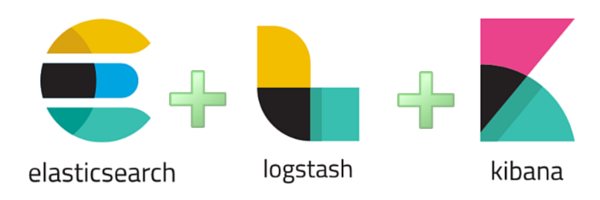
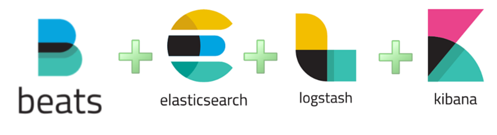

# ELK란

- Logstash : 데이터 수집
- Elasticsearch : 데이터 분석 및 저장
- Kibana : 데이터 시각화

가 합쳐진 Log 및 데이터 분석 도구이다.

## ELK Stack도 있어?

- Beats : 서버에 에이전트로 설치되며 데이터를 Elasticsearch나 Logstash로 전송하는 발송자

가 추가 된 구조